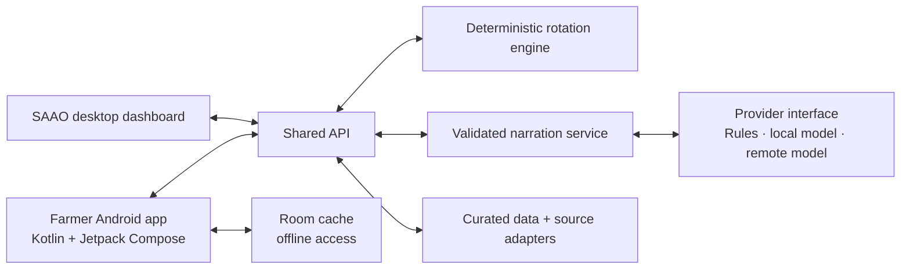

# Project EDEN — Earth Data & Environment Navigator

**NASA Space Apps Challenge 2026 · Team WinR**

EDEN is a Bangla-first crop-rotation decision-support project. Its goal is to help farmers and agricultural officers make clearer decisions using traceable climate, soil, crop, and local agricultural evidence.

## Project status

The default branch currently contains the team's research and data-source work. The application architecture below is the agreed target; the production apps and shared services have not yet been merged into `main`. The current screen-design work is on [`feature/eden-screen-recreation-rayyan`](https://github.com/muhammadTasin/project-eden-earth-data-environment-navigator/tree/feature/eden-screen-recreation-rayyan/design).

## Architecture

The Android farmer app and SAAO desktop dashboard use one API. Crop scoring stays deterministic and testable; AI can help explain a recommendation, but it does not decide the score.



### Repository layout

```text
apps/
  saao-dashboard/       SAAO officers' desktop web app
  farmer-mobile/        Native Android app and APK; Kotlin + Jetpack Compose

services/
  api/                  Shared API used by both apps

packages/
  contracts/            Shared API and domain types
  rotation-engine/      Deterministic crop scoring and historical replay
  narration-core/       Advice narration and output validation

research/               Data sources, acquisition scripts, and curated datasets
design/                 Screen designs, previews, and design notes
```

### Boundaries and design rules

- **Android:** Kotlin source (`.kt`), Jetpack Compose UI, ViewModels for screen state, and Room for cached farm data and advice. The app should remain useful offline and show when cached information was last updated.
- **Dashboard:** a desktop web app for agricultural officers. It calls the shared API instead of duplicating recommendation logic.
- **API:** validates requests, coordinates data and domain services, and returns versioned responses described by `packages/contracts/`.
- **Recommendations:** `packages/rotation-engine/` owns deterministic scoring and replay. Keep scoring rules out of app code and model prompts.
- **Narration and models:** `packages/narration-core/` validates advice. Put rules-based, local-model, and remote-model implementations behind a replaceable provider interface. A model can explain validated results; it must not silently change scores or invent evidence.
- **Research and provenance:** keep acquisition scripts, source notes, and curated data in `research/`. Preserve source and update metadata so recommendations can be traced back to evidence.
- **Feature growth:** keep app screens and feature-specific behavior in the relevant app; put reusable domain logic in packages; expose backend capabilities through the API. Keep these boundaries so a feature or model provider can be replaced without rewriting both clients.

The TypeScript API and shared packages use npm tooling; the Android app uses its own Gradle/Kotlin build. Keep the Android toolchain independent from the web build.

## Research

See [`research/README.md`](research/README.md) for the current data inventory, source notes, and acquisition workflow. Do not commit secrets, local environment files, generated build outputs, or personal farmer data.

## Team

- muhammadTasin
- Anindya Shiddhartha
- Jarin Subah
- Mohammed Rayyanul Haque
- Safin Rahman
- Tasrif Ahmed
