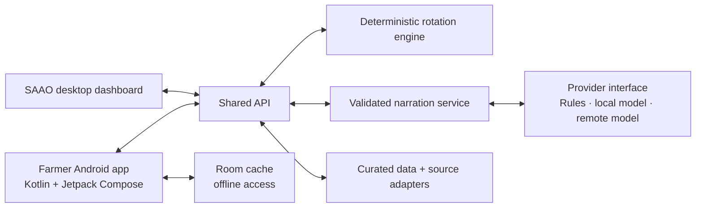

# Project EDEN — Earth Data & Environment Navigator

**NASA Space Apps Challenge 2026 · Team WinR**

EDEN is a Bangla-first crop-rotation decision-support project. Its goal is to help farmers and agricultural officers make clearer decisions using traceable climate, soil, crop, and local agricultural evidence.

## Project status

The default branch currently contains the team's research and data-source work. The application architecture below is the agreed target; the production apps and shared services have not yet been merged into `main`. The current screen-design work is on [`feature/eden-screen-recreation`](https://github.com/muhammadTasin/project-eden-earth-data-environment-navigator/tree/feature/eden-screen-recreation/design).

## Architecture

The Android farmer app and SAAO desktop dashboard use one API. Crop scoring stays deterministic and testable; AI can help explain a recommendation, but it does not decide the score.



### Repository layout

```text
apps/
  saao-dashboard/       SAAO officers' desktop web app
  farmer-mobile/        Native Android app and APK; Kotlin + Jetpack Compose

services/
  api/                  Shared API used by both apps

packages/
  contracts/            Shared API and domain types
  rotation-engine/      Deterministic crop scoring and historical replay
  narration-core/       Advice narration and output validation

research/               Data sources, acquisition scripts, and curated datasets
design/                 Screen designs, previews, and design notes
```

### Boundaries and design rules

- **Android:** Kotlin source (`.kt`), Jetpack Compose UI, ViewModels for screen state, and Room for cached farm data and advice. The app should remain useful offline and show when cached information was last updated.
- **Dashboard:** a desktop web app for agricultural officers. It calls the shared API instead of duplicating recommendation logic.
- **API:** validates requests, coordinates data and domain services, and returns versioned responses described by `packages/contracts/`.
- **Recommendations:** `packages/rotation-engine/` owns deterministic scoring and replay. Keep scoring rules out of app code and model prompts.
- **Narration and models:** `packages/narration-core/` validates advice. Put rules-based, local-model, and remote-model implementations behind a replaceable provider interface. A model can explain validated results; it must not silently change scores or invent evidence.
- **Research and provenance:** keep acquisition scripts, source notes, and curated data in `research/`. Preserve source and update metadata so recommendations can be traced back to evidence.
- **Feature growth:** keep app screens and feature-specific behavior in the relevant app; put reusable domain logic in packages; expose backend capabilities through the API. Keep these boundaries so a feature or model provider can be replaced without rewriting both clients.

The TypeScript API and shared packages use npm tooling; the Android app uses its own Gradle/Kotlin build. Keep the Android toolchain independent from the web build.

## Research

See [`research/README.md`](research/README.md) for the current data inventory, source notes, and acquisition workflow. Do not commit secrets, local environment files, generated build outputs, or personal farmer data.

## মাঠের কথা · Mather Kotha, the field speaks

Challenge 07, Field Shift. A voice-first crop-rotation planner for Bangladesh. For every union it keeps 25 seasons
of NASA Earth observations, replays each candidate rotation through them, adds the union's soil tests and the
farmer's own priorities, and tells the farmer in Bangla, by phone, which rotation fits their land, water and cows,
and why.

**Status, 28 September 2026: pre-event research.** The Space Apps FAQ says teams may not begin working on the
challenge before the hackathon, so this repository holds data access, checks and design; the product is built at
the event. The plan, pitch and architecture: [Mather Kotha Blueprint](https://claude.ai/artifact/9z6mQsxxFcZEPawPC3Uko2).

## How it will work

1. **Data**: NASA POWER, GPM IMERG, SMAP, MODIS and VIIRS, GRACE-FO, GLDAS, NASADEM; SRDI soil, BRRI, BARI and
   BWMRI crops, BBS yields and prices.
2. **Trust and cache**: NASA temperatures corrected against BMD gauges; rain sources compared before any alert.
3. **Engine**: season features, a 25-season replay of each candidate rotation, six scores (water, heat, flood,
   soil, fodder, income), ranking by the farmer's priorities, in-season triggers.
4. **Advice JSON**: numbers, confidence, sources and actions from an approved list.
5. **Voice**: a language model rephrases the advice in Bangla; a checker rejects any changed number.
6. **Reach**: a pre-season call, trigger calls, a missed-call IVR, SMS and a dashboard for SAAOs.

## What the research shows so far

- **One seed choice changes the year (Tanore).** BRRI dhan71 frees the field by 10 November, in time for lentil or
  mustard; BRRI dhan49 by 19 November, too late. Winter water beyond rain: Boro 798 mm, wheat 198, lentil 200,
  mustard 114 (FAO-56 on 24 winters of NASA POWER and IMERG).
- **The water is going.** GRACE-FO: Bangladesh's water storage falls 0.40 cm a year. GLDAS: groundwater under
  Tanore fell 147 mm since 2003-07; it falls in 50 of 64 districts, fastest in the north-west.
- **Early Boro escapes the haor's flash floods.** IMERG rain of 200 mm or more in 3 days over Meghalaya flags the
  big flood springs (2004, 2010, 2017). BRRI dhan28 was still in the field for 4 of the 5 largest bursts;
  BRRI dhan88, 81 and 89 for one, and none when sown two weeks early.
- **Heat is shifting.** Nights at Aman flowering warm 0.24-0.43 C a decade at all five pilots; late-sown wheat
  meets two to three times the hot days at grain filling.
- **Checked, not assumed.** SMAP productivity does not confirm the replay's dry-spell seasons at Tanore, where
  farmers likely irrigate, so rescue water counts as a cost; IMERG's fast run has read too dry since 2023, so no
  alert rests on one rain source.

## Repository

```
research/
  acquire/        scripts that download (research/data/ is the gitignored cache)
  explore/        scripts that turn the cache into tables
  crops/ soil/ bbs/ floods/ pilots/ livestock/ sites/    the tables (CSV, committed)
  run_analyses.py rebuilds the tables from the cache
  README.md       every dataset, how it was checked, what is still missing
```

## Reproduce

```bash
python -m pip install -r research/requirements.txt
```

Copy `.env.example` to `.env` with a free Earthdata Login, and in the Earthdata profile authorise
**NASA GESDISC DATA ARCHIVE**. Run the `research/acquire/` scripts listed in `research/README.md` (POWER, IMERG,
GLDAS, AppEEARS, GRACE-FO, the document sources), then:

```bash
python research/run_analyses.py all
```

## Data

NASA: POWER, GPM IMERG, SMAP (L3, L4, L4 carbon), MODIS and VIIRS NDVI, MODIS ET, GRACE/GRACE-FO, GLDAS-2.2,
NASADEM, GIBS. Bangladesh and partners: SRDI, BRRI, BARI, BWMRI, BBS, BMD (through NOAA GSOD), FFWC/BWDB, DLS,
DAM prices (through WFP), FAO, ISRIC SoilGrids, JRC Global Surface Water, geoBoundaries, ECMWF forecasts
(through Open-Meteo). Sources, licences and checks for each are in `research/README.md`.

## Team

- muhammadTasin
- Anindya Shiddhartha
- Jarin Subah
- Mohammed Rayyanul Haque
- Safin Rahman
- Tasrif Ahmed

Research scripts and write-ups were prepared with AI assistance (Claude).
