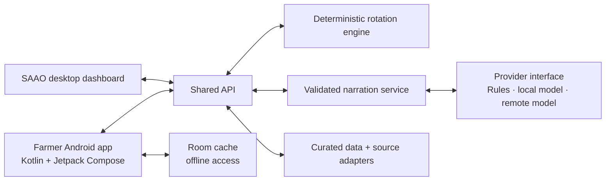

# Project EDEN — Earth Data & Environment Navigator

**NASA Space Apps Challenge 2026 · Team WinR · Challenge 07: Field Shift**

EDEN is a Bangla-first crop-rotation decision-support system for Bangladesh. Its farmer-facing service is **মাঠের কথা · Mather Kotha** ("the field's words"): before the Rabi season the farmer's phone rings, and a Bangla call names the two best rotations for their land, water, cattle and priorities, with 25 seasons of NASA Earth observations behind them. Agricultural officers (SAAOs) work from a desktop dashboard, and farmers with smartphones can use the Android app. Every number traces back to the research data in this repository.

## Project status (1 October 2026)

`main` holds all of the team's work, merged on 1 October 2026:

| Part | Folder | What works |
|---|---|---|
| Research and data | `research/` | NASA and local datasets with their checks, the 25-season replay for the Tanore pilot, signals for five pilots, and the generator for the app's data release |
| Rotation engine | `packages/rotation-engine/` | 5 rotations replayed through 25 seasons, 7 scores. The Talanda pilot uses data release `tanore-2026.09.30` (research commit `0469020`); every other upazila uses its district's replay (`national_replay.json`) |
| API | `services/api/` | Advice, checked Bangla narration, keypad events, Krishi officer desk, early warnings, NASA POWER weather, river erosion, the evidence-only assistant, sign-in |
| SAAO dashboard | `apps/saao-dashboard/` | Bangla and English, officer desk, less-pesticide (IPM) tab, early warnings, environment ledger |
| Android app | `apps/farmer-mobile/` | Farmer card synced from the API with an offline cache, weather, river erosion, assistant, sign-in, farm profile editing |
| Screen designs | `design/` | Six SAAO desktop screens and the portrait mobile companion |
| Daily NASA update | `research/live/` | NASA POWER every day for all 544 upazilas (64 districts), plus GPM IMERG rain at 10 km with an Earthdata Login |

The dashboard advises any of the 544 upazilas (pick the district and upazila at the top of the overview); Talanda union (Tanore) remains the most detailed pilot. Sample farmers, the farm profile and the income scores are sample values and are labelled as such on screen. The story site that presents the project lives in its own repository, [Mati-Kohon](https://github.com/Tasrif-Ahmed-Mohsin/Mati-Kohon). Changes are listed, newest first, in [`CHANGELOG.md`](CHANGELOG.md).

## Run it

```bash
npm install
npm test          # 11 engine tests and every API check
npm start         # API and SAAO dashboard on http://localhost:4000
```

- **Language:** the বাংলা / EN buttons in the dashboard header switch every text; the browser remembers the choice.
- **Krishi officer desk:** tab ৬ / 6, demo access code `talanda-demo` (set `EDEN_OFFICER_CODE` to change it). **Restore sample data** resets the sample farmers before a recording.
- **Farmer sign-in (app):** a farmer ID or phone number with the demo PIN `1234`. Both sign-ins are demo gates, not real authentication.
- **Weather:** `/api/v1/weather` fetches NASA POWER over the internet and caches it; offline, it serves a fixed baseline marked as not live.
- **Android app:** build steps and screens are in [`apps/farmer-mobile/README.md`](apps/farmer-mobile/README.md). The emulator reaches the API at `http://10.0.2.2:4000`; run its unit tests with `./gradlew test` in `apps/farmer-mobile`.

### Every upazila

`python research/explore/national_replay.py` runs the Tanore replay's method (FAO-56 water balance, BRRI and BARI calendars, heat at flowering and grain filling) at each of the 64 districts' NASA POWER and GPM IMERG point for 2001–2025, with temperatures corrected against the nearest BMD station within 100 km, and writes `packages/rotation-engine/src/data/national_replay.json`. `packages/rotation-engine/src/data/location.ts` points the engine at the chosen place: the Talanda pilot, or an upazila using its district's replay. At Rajshahi district it reproduces Tanore's research figures closely (BRRI dhan71: 7 of 25 rescue seasons; Boro 790 mm against 797 mm).

Where a place has no data yet, the dashboard says so instead of borrowing Tanore's: SMAP soil moisture, MODIS greenness and land use are pilot-only so far; fertilizer doses use the SRDI Talanda card until each upazila's card is added; upazila names are in English. `GET /api/v1/places` lists the places, `GET /api/v1/overview?place=<id>` and `POST /api/v1/advice` with `unionId: <id>` follow the choice.

### Daily NASA update (all 544 upazilas)

```bash
python research/acquire/imerg_nrt.py --days 10   # optional: GPM IMERG rain, needs an Earthdata Login in .env
python research/live/daily_update.py            # NASA POWER for every upazila, no login
```

The script writes `services/api/data/live/upazila_conditions.json`: for each upazila, rain (1, 7 and 30 days, and 30-day rain against the same dates in 2016–2025), maximum and minimum temperature, days at 35 °C or more, root-zone and surface soil wetness, and IMERG rain over 1, 3 and 7 days, each with its date. NASA POWER is about 3 days behind and IMERG 1 to 2 days. The dashboard overview shows it for any district and upazila, and `/api/v1/live/*` serves it.

The same run reads the **live haor flash-flood check**: the last 3 days of IMERG rain at Sohra, scaled up because IMERG's quick runs read about 9% below the final run there, against the levels tested on 25 springs (200 mm watch, 250 mm warning, 15 March to 15 May); the Jaintia Hills, Garo Hills and Barak valley, which feed the other haor districts, shown without tested levels yet; and NASA's MODIS flood map (3-day composite on GIBS, no login) for the haor basin: unusual flood water, seasonal flood water and cloud. `/api/v1/haor/flash-flood` and the overview's early warnings carry it as `live`, and the dashboard's flash-flood card shows it. River gauges must still confirm before any call goes out.

The dry and wet labels are provisional: POWER's newest weeks come from near-real-time inputs that read drier than the reprocessed archive, so they wait for the SMAP check (next step).

`.github/workflows/daily-nasa-update.yml` runs this every morning at 09:30 Bangladesh time and commits the file when it changes. GitHub runs scheduled workflows only from `main`. For IMERG, add the repository secrets `EARTHDATA_USERNAME` and `EARTHDATA_PASSWORD` (Settings → Secrets and variables → Actions); without them only POWER updates.

A two-minute dashboard walkthrough for a demo video:

1. **Overview (১):** dated NASA values (SMAP root zone, 30-day IMERG rain checked against MERRA-2, GRACE-based groundwater, MODIS winter greenness), the early warnings (haor flash floods, warm nights, cattle heat) and field pest reports.
2. **Planner (২):** set "Aman in the field this season" to BRRI dhan49 and run. Lentil and mustard miss their 14–15 November deadlines, and dhan49 → wheat is tagged as possible this season.
3. **Comparison (৩):** seven scored dimensions, each with its reason and a `sample` or `assumed` tag where the data is weak.
4. **Environment and less pesticide (৫):** the recommended rotation against the usual Boro rotation, the environment ledger, and sourced IPM steps.
5. **Officer desk (৬):** sign in, open the most urgent farmer, record a field observation, and watch that farmer's advice and queue position update.
6. **Call delivery (৮):** press keypad 1 (water) and mustard moves to the top; press 9 and the call-back request lands on the officer desk.
7. Switch to **EN** at any point; the Bangla voice script gets an English translation underneath.

## Architecture

The Android farmer app and the SAAO desktop dashboard use one API. Crop scoring stays deterministic and testable; language tools can help explain a recommendation, but they never decide the score.



### Repository layout

```text
apps/
  saao-dashboard/       SAAO officers' desktop web app
  farmer-mobile/        Native Android app; Kotlin + Jetpack Compose
services/
  api/                  Shared API used by both apps
packages/
  contracts/            Shared API and domain types
  rotation-engine/      Deterministic crop scoring and historical replay
  narration-core/       Advice narration and output validation
research/               Data sources, acquisition and analysis scripts, curated tables, the data-release generator
design/                 Screen designs, previews and design notes
raw, collected datas/   Links to raw source material
test_pipeline.ts        Engine tests
test_server.js          API tests
```

The TypeScript API and shared packages use npm workspaces; the Android app has its own Gradle/Kotlin build under `apps/farmer-mobile/` and is not an npm package.

### Boundaries and design rules

- **Android:** Kotlin, Jetpack Compose, ViewModels for screen state, Room for cached farm data and advice. The app stays useful offline and shows when cached information was last updated.
- **Dashboard:** calls the shared API instead of duplicating recommendation logic.
- **API:** validates requests, coordinates data and domain services, and returns versioned responses described by `packages/contracts/`.
- **Recommendations:** `packages/rotation-engine/` owns deterministic scoring and replay. Keep scoring rules out of app code and model prompts.
- **Narration and models:** `packages/narration-core/` validates advice. Rules-based, local-model and remote-model providers sit behind one replaceable interface; a model may explain validated results but must not change scores or invent evidence.
- **Research and provenance:** acquisition scripts, source notes and curated data stay in `research/`, with source and update metadata, so every recommendation can be traced to its evidence.
- **Feature growth:** screens and feature-specific behaviour go in the relevant app, reusable domain logic in packages, backend capabilities behind the API.

### Where new code and data go

- SAAO dashboard UI and browser behaviour: `apps/saao-dashboard/`.
- Farmer-facing Android UI, navigation and device behaviour: `apps/farmer-mobile/`, with screen state in ViewModels and immutable UI state for Compose. Read cached advice and farm data from Room, show when it was last updated, and sync when connectivity allows.
- HTTP endpoints and server-side orchestration: `services/api/`. Shared request and response types: `packages/contracts/`.
- Generated advice wording and its validation: `packages/narration-core/`.
- Data acquisition and analysis scripts, source notes, provenance and small curated tables: `research/`. The downloaded cache under `research/data/` is ignored by Git; rebuild it with the scripts in `research/acquire/`.
- Stitch exports, screen previews and design notes: `design/`. Production UI code belongs in the relevant app.

Do not commit secrets, local environment files, dependency folders, generated APK/AAB files or real farmer personal information.

## API

| Method | Path | What it does |
|---|---|---|
| GET | `/api/v1/overview` | Dated research conditions, alerts, sample farmer rows, union pest reports, `early_warnings` (haor, warm nights, cattle heat) and `soil_carbon` |
| POST | `/api/v1/advice` | Ranked rotations; `farmerId` applies that farmer's officer observation; `currentAmanCrop` adds the this-season check; 422 for unions without research data |
| POST | `/api/v1/narrate` | Checked Bangla script, with `englishGloss`, for one option |
| POST | `/api/v1/channel-events` | Simulated IVR keypad: 1–4 re-rank by priority, 9 creates an officer call-back |
| GET | `/api/v1/data-release` | Datasets, periods, calibration and status |
| GET | `/api/v1/haor/flash-flood` | Haor flash-flood trigger: Sohra thresholds, 25-season hindcast, Boro variety escape, the season status and `live` (today's upstream IMERG rain and the MODIS flood map) |
| GET | `/api/v1/weather` | NASA POWER daily agroclimatology and SMAP root-zone moisture for the pilot, fetched live and cached; observations, not a forecast |
| GET | `/api/v1/erosion` | Riverbank erosion risk for the Jamuna corridor from BWDB/FFWC station records and IMERG basin rain |
| POST | `/api/v1/ai/ask` | Bangla assistant that answers only from the project's evidence and refuses out-of-scope questions such as loans or pesticide brands; rules-based, with no outside AI service |
| POST | `/api/v1/auth/login` | Officer (access code) or farmer (ID or phone and PIN) sign-in, returns a session token |
| GET | `/api/v1/auth/session` | The signed-in user for a Bearer token |
| POST | `/api/v1/auth/logout` | Ends the session |
| GET | `/api/v1/live/status` | The daily NASA update: when it ran, each source's latest date and age, and the method |
| GET | `/api/v1/live/upazilas?district=` | Compact daily conditions for every upazila, or one district's |
| GET | `/api/v1/live/upazila?id=` / `?name=` / `?lat=&lon=` | Full daily conditions for one upazila, or the nearest to a point |
| GET | `/api/v1/places` | The pilot and all 544 upazilas the engine can advise |
| GET | `/api/v1/officers` | Officers who can sign in to the desk (no secrets) |
| POST | `/api/v1/officer/login` | `{ officerId, accessCode }`, returns a desk session token |
| GET | `/api/v1/officer/desk` | Queue, farmer register, observations and call-backs (Bearer token) |
| POST | `/api/v1/officer/observations` | Saves a field observation and returns the farmer's updated advice |
| POST | `/api/v1/officer/callbacks/:id/resolve` | Marks a call-back done |
| GET | `/api/v1/officer/knowledge` | Officer reference pack |
| POST | `/api/v1/officer/reset` | Restores the sample farmers (demo) |

## Tests

`npm test` runs `test_pipeline.ts` (engine) and `test_server.js` (API). They check:

- the ranking, feature flags and narration gates (a fake model that invents "১২ টন" and a loan offer falls back to the template);
- that Boro is scored with Boro data, that unions without data are refused and that a stated priority leads the ranking;
- that the Android offline seed matches the engine, and that the environment ledger matches the research ledger;
- the pest score and the English fields;
- the early warnings and the 25-season haor hindcast;
- officer sign-in, queue order, observation priority, the note filter, keypad-9 call-backs and the reference pack;
- that every dashboard text has an English translation;
- NASA POWER weather, river erosion, the farmer sign-in lifecycle and the assistant's grounded answers and refusals.

Online, the weather check reads NASA POWER live; offline, the API serves a fixed baseline marked `isLive: false`, so the tests also pass without internet.

### How to…

- **Add or change a dashboard text:** write the Bangla in `index.html` with a new `data-i18n="section.key"`, then add the English under the same key in `i18n.js`. The test lists anything missing.
- **Update the numbers:** re-run the generator (next section), then `npm test`. If TEST 9 fails, refresh the Android seed (`AdviceModels.kt`) from the engine's `farmer_card`.
- **Add a scoring dimension:** write a plugin in `packages/rotation-engine/src/plugins/`, register it in `registry.ts`, add its name to `DIMENSIONS` in `app.js`, and add a bar colour in `styles.css`.
- **Change the officer access code:** set `EDEN_OFFICER_CODE` before `npm start`.

## Research

The research behind every score lives in [`research/`](research/README.md): every dataset, how it was checked, and what is still missing.

What it shows so far:

- **One seed choice changes the year (Tanore).** BRRI dhan71 frees the field by 10 November, in time for lentil or mustard; BRRI dhan49 by 19 November, too late. Winter irrigation in a median season: Boro 797 mm, wheat 198, lentil 199, mustard 114 (FAO-56 water balance on 25 winters of NASA POWER and GPM IMERG).
- **The water is going.** GRACE/GRACE-FO: Bangladesh's stored water falls 0.40 cm a year. GLDAS-2.2: groundwater under Tanore fell 147 mm between 2003–07 and 2021–25; it fell in all 64 districts, significantly in 50, fastest in the north-west.
- **Early Boro escapes the haor's flash floods.** IMERG rain of 200 mm or more in 3 days at Sohra, upstream in Meghalaya, flags the big flood springs (2004, 2010, 2017). BRRI dhan28 was still in the field for 4 of the 5 bursts of 250 mm or more; the other five Boro varieties for at most one, and none when sown two weeks early.
- **Heat is shifting.** Nights at early Aman (BRRI dhan71) flowering warm by 0.24 to 0.43 °C a decade at the five pilots. In 2011–2025, wheat sown on 10 December met about 2 to 5 times the hot days at grain filling of wheat sown on 20 November.
- **Checked, not assumed.** SMAP productivity does not confirm the replay's dry-spell seasons at Tanore, where farmers likely irrigate, so rescue water counts as a cost; IMERG's fast run has read too dry since 2023, so no alert rests on one rain source.

Rebuild the research tables:

```bash
python -m pip install -r research/requirements.txt
python research/run_analyses.py all
```

Copy `.env.example` to `.env` with a free Earthdata Login, authorise **NASA GESDISC DATA ARCHIVE** in the Earthdata profile, and run the `research/acquire/` scripts listed in `research/README.md` first.

**Data:** NASA POWER, GPM IMERG, SMAP (L3, L4, L4 carbon), MODIS and VIIRS NDVI, MODIS ET, GRACE/GRACE-FO, GLDAS-2.2, NASADEM and GIBS; SRDI, BRRI, BARI, BWMRI, BBS, BMD (through NOAA GSOD), FFWC/BWDB, DLS, DAM prices (through WFP), FAO, ISRIC SoilGrids, JRC Global Surface Water, geoBoundaries and ECMWF forecasts (through Open-Meteo). Sources, licences and checks are in `research/README.md`.

### The app's data release

`packages/rotation-engine/src/data/tanore_replay_data.ts` is generated from the research tables: the 25-season NASA POWER + IMERG replay, BMD-corrected heat windows, the SRDI Talanda card, BRRI/BARI/BWMRI sowing windows, SMAP L4, GLDAS-2.2, MODIS, BBS, GLW4, the haor hindcast, cattle heat and the environment ledger. Do not edit it by hand; regenerate it from the repository root:

```bash
python research/export/eden_release.py --out packages/rotation-engine/src/data/tanore_replay_data.ts
npm test
```

The latest SMAP soil-moisture values come from the downloaded cache (`research/data/appeears/l4/smap_l4_daily.parquet`, built by `research/acquire/`), which Git ignores. Without the cache the generator writes `smap: null`, so regenerate from a checkout that has it; every other number comes from the committed tables. Labels and the illustrative income figures live in `packages/rotation-engine/src/data/crop_catalog.ts`.

## Known limits

- Upazilas outside the Talanda pilot use their district's NASA point (about 50 km grid), the SRDI Talanda fertilizer card as a stand-in, and no SMAP, MODIS greenness or land-use context yet. Unknown places get HTTP 422.
- Income is a team estimate until DAM farm-gate prices and farmer cost interviews are in.
- The pest score is rule-based until officers log pest counts.
- Floods are not modelled for Barind land. The haor warning shows the 25-season hindcast and the season status; a live trigger needs a daily IMERG Early feed and river-gauge confirmation. Rotation advice is not modelled for the haor.
- Flooded-rice days stand in for methane; they are not a methane measurement.
- NASA POWER weather arrives 2–3 days late and is not a forecast. River-erosion risk comes from station records and needs checking on the ground.
- Sign-in uses a shared officer code, a demo farmer PIN, in-memory sessions and a JSON file store; a real deployment needs proper accounts and a database.
- The Android app's API address works in the emulator only.

## Branches

On 1 October 2026 every working branch was merged into `main`: `research/data-access` (`0469020`) and `codex/android-app-latest` (`8e633aa`), which already carried `codex/android-apk`, `feature/eden-screen-recreation` and `demo/research-data`. The old branches stay for reference; start new work from `main`.

## Team

- muhammadTasin
- Anindya Shiddhartha
- Jarin Subah
- Mohammed Rayyanul Haque
- Safin Rahman
- Tasrif Ahmed
